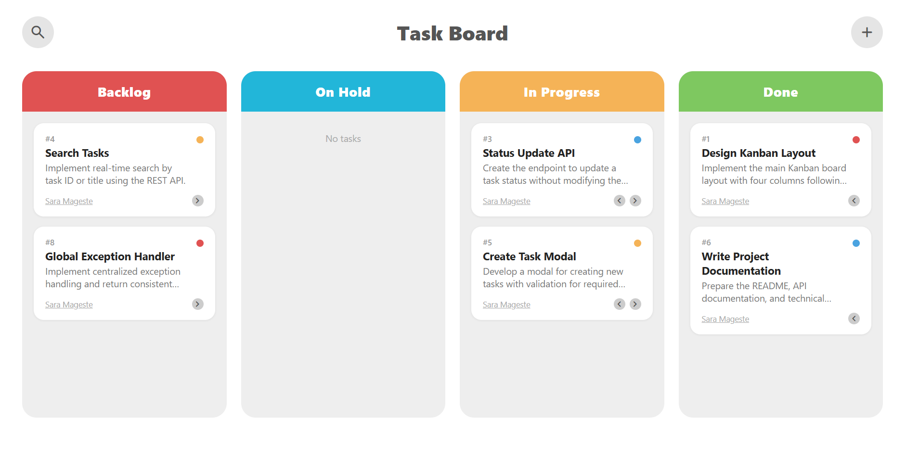
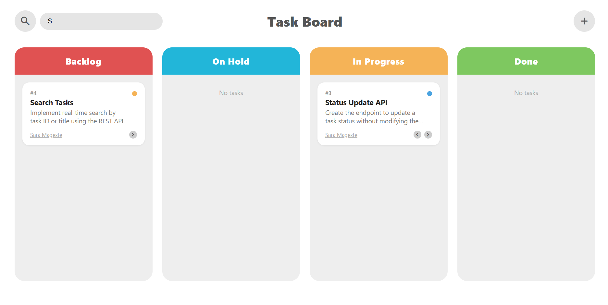
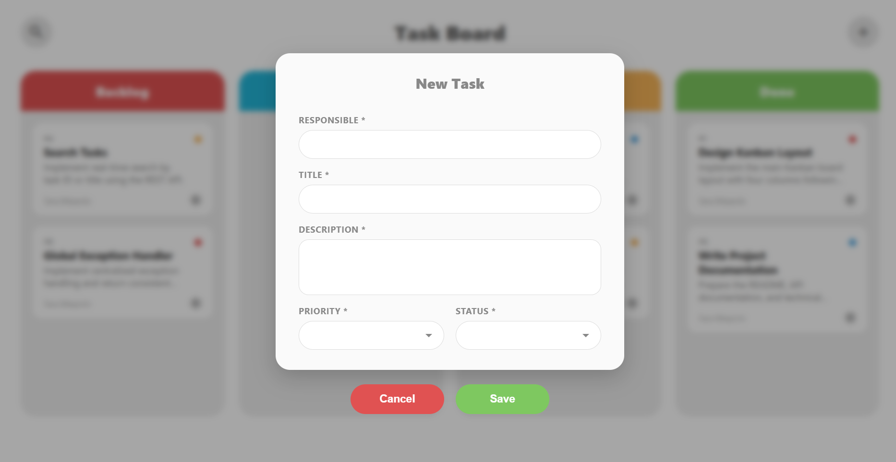
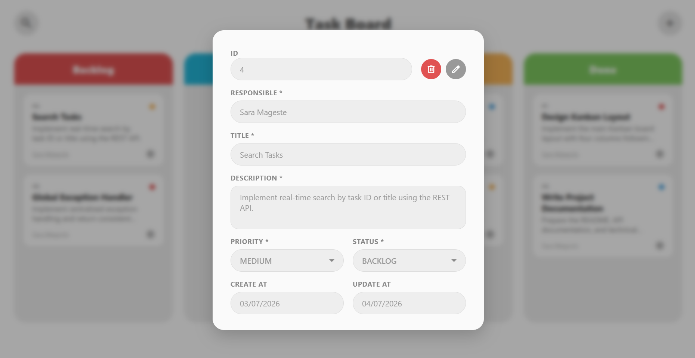
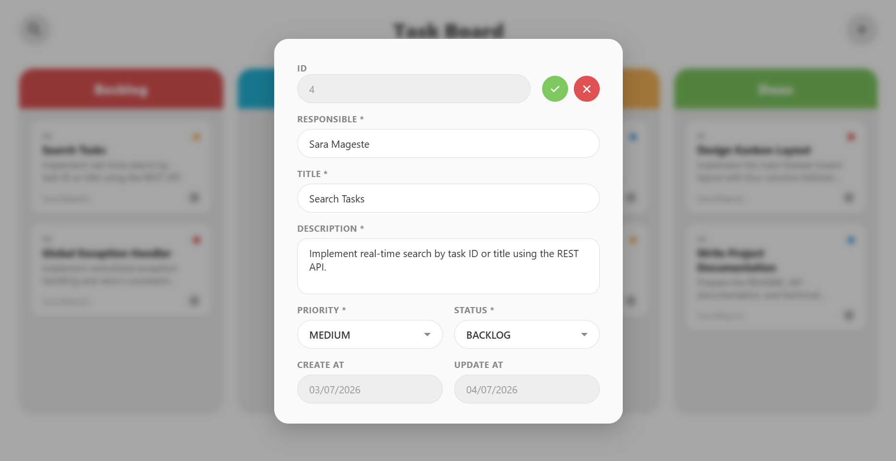
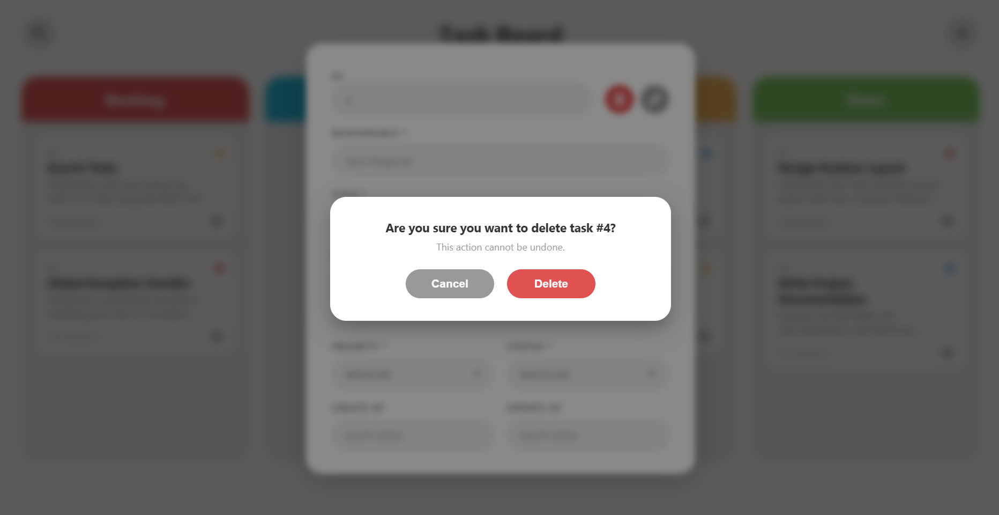

# Task Board

A simple Kanban-style task management application, built as a technical assessment (Full Stack Java/Angular position).

The app lets you create, view, edit, move, and delete tasks across four columns: **Backlog**, **On Hold**, **In Progress**, and **Done**.

## Screenshots

 






## Tech Stack

| Layer      | Technology                                   |
|------------|-----------------------------------------------|
| Frontend   | Angular 21 (standalone components, signals)   |
| Backend    | Java 21, Spring Boot 3.5.16                   |
| Database   | MySQL 8.0 (via Docker)                        |
| API Docs   | Swagger / OpenAPI (springdoc)                 |
| Testing    | JUnit 5 + Mockito (backend)                   |

## Project Structure

```
task-board/
├── backend/     Spring Boot REST API
├── frontend/    Angular application
├── docs/        Additional documentation (technical notes, incident analysis, screenshots)
└── docker-compose.yml
```

Detailed setup instructions for each part:
- [Backend README](./backend/README.md)
- [Frontend README](./frontend/README.md)

Additional documentation:
- [Technical decisions & trade-offs](./docs/technical-decisions.md)

## Quick Start

You'll need **Docker**, **Java 21**, **Maven**, and **Node.js** installed.

1. **Start the database** (from the repository root):
   ```bash
   docker-compose up -d
   ```
   This starts a MySQL 8.0 container on port `3307`.


2. **Start the backend** (see [backend/README.md](./backend/README.md) for details):
   ```bash
   cd backend
   mvn spring-boot:run
   ```
   API available at `http://localhost:8080`. Swagger UI at `http://localhost:8080/swagger-ui/index.html`.


3. **Start the frontend** (see [frontend/README.md](./frontend/README.md) for details):
   ```bash
   cd frontend
   npm install
   npm start
   ```
   App available at `http://localhost:4200`.

## Author

Built by Sara Mageste.